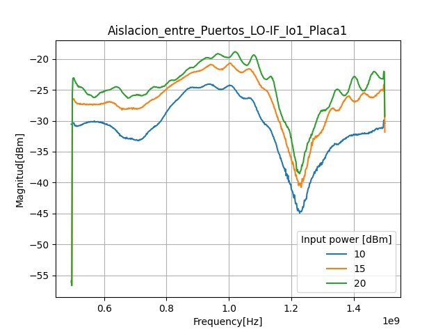
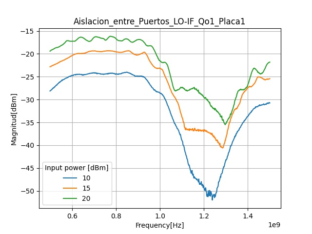
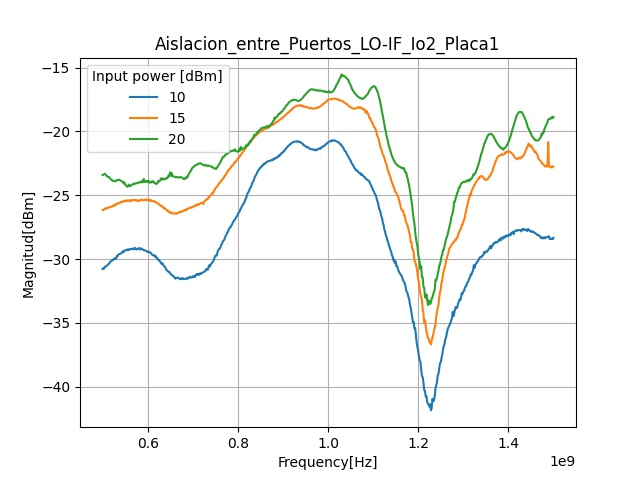
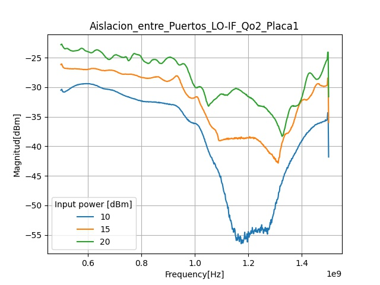

> # Describir conexionado, señales que estan y no estan
> # Aislacion, en señales parasitas RF,LO (con y sin RF)
> # Perdidas, en señales de interes IF
> # Diferencia en path total vs dif en componentes discretos 

> # Ver armonicas antes de hacer un barrido de frecuencia (las arm pueden tener mayor potencia que la señal en algun punto)

-----------------------
# Observaciones
Para aislacion RF/IF se noto que en ciertos puentos las armonicas tenian mas potencia que que la señal de entrada RF, esto hace inviable un barrido de frecuencias para la asilacion. Si bien en algunos puntos la grafica muestra el nivel de RF, en otros muestra el nivel de las armonicas aun cuando RF se anule.

Frecuencias discretas variando segun se observa el comportamiento.

# Aislacion RF/IF Io1
* imp 50 el LO
* RF: 10dBm,13dBm
* frec: 100, 200, 250, 500, 1000

Notamos que entre 200 - 300 Mhz la señar de RF no aparece en la salida pero si sus armonicas con mayor amplitud.
Para valores mayores a 300 empezamos a notar que la aislacion ya no era buena sino que se tiene la misma RF aumentando su amplitud a medida que crece la frecuencia.

splitQ = -4dB
split = -8.5dB

----------------------------------------

# Plan de mediciones FIADC
---------------------------------
## Instrumental:
* RIGOL-DSA815: Analizador de espectro.
* HP-8350B: Generador de barrido.
* SG384: Generador de funciones.
* INGWSTEK usbs

## Placas:
* Placa1 (sin salida de spliter en cuadratura).
* Placa2 (LO con salidas en fase y cuadratura).
-------------------------------------------------

## Mediciones en funcionamiento directo.
-------------------------------------------------

### Aislacion LO/IF (Placa1).
Se analizo la aislacion entre el LO y las salidas IF.

#### Set-up:

* HP-8350B: 
* * frec: 500MHz - 1.5GHz.
* * time: 10ms.
* * pwr: 10/15/20dBm (rehacer para 5/10/15) 

* RIGOL-DSA815.

Se ingreso 1GHz en el LO y se obtuvo la tabla de armonicas para las salidas, con diferentes potencias del LO. (impedacia de 50 en RF)

"imagenes de armonicas"

Luego se realizo un barrido en frecuencias para el LO y se obtuvieron las respuestas para las salidas I/Q de ambos canales, para diferentes potencias del LO. 

***Ch1 I/Q:***

***Ch2 I/Q:***

"entre 1.1/1.2GHz hay mas atenuacion"

----------------------------------------------

## Aislacion RF/IF (Placa1)
-------------------------------

### Set-up

* HP-8350B: 
* * frec: 0GHz - 1.5GHz.
* * time: 10ms.
* * pwr: 10/15/20dBm (rehacer para 5/10/15) 

* RIGOL-DSA815.

Se ingreso 1.2GHz en la entrada de RF y se obtuvo la tabla de armonicas para las salidas con diferentes potencias del LO. 

"imagenes de armonicas"

Luego se realizo un barrido en frecuencias para el LO y se obtuvieron las respuestas para las salidas I/Q de ambos canales. 

***Ch1 I/Q:***

***Ch2 I/Q:***

"entre 1.1/1.2GHz hay mas atenuacion"

# MAXIMOS
1. IN=2GHz (2*LO)
2. CLK=BW SPLITQ
3. OUT=2GHz (2*LO)

---------------------------------------------

-----------------------------------------------

## Aislacion LO/RF (pl1)
* HP 8350B: fc: 1GHz.
* pwr: 5/10/15dBm.

* Medicion: Att LO/RF (pwrLO-pwrRF), canales I,Q, Promediado para 5,10,15dBm.

### Att
1. Para 5dBm:  5-(-43.5)=48.5dB 
2. Para 10dBm: 10-(-40)=50dB
3. Para 15dBm: 15-(-39.2)=54.3dB

Promedio : 50.9 dB

---------------------------------------

## SPLITER-QUAD *(BW: 675-1300MHz)* (pl2)
* HP 8350B: start: 675MHz - stop: 1.3GHz.
* time: 10ms - pwr: 5/10/15dBm.

* Resp: Cos1
* AttMedia: 3.4dB aprox.

* Resp: Sin1
* AttMedia: 3.5aprox.

Datos tomados: csv/graficos python.

-----------------------------------------------

## MIXER-CONVLOSS *(BW: 675-1300MHz)*
* HP 8350B: start: 675MHz - stop: 1.3GHz.
* time: 10ms - pwr: 5/10/15dBm.
* RIGOL DSA815

* Resp: Cos1
* AttMedia: 3.4dB aprox.

* Resp: Sin1
* AttMedia: 3.5aprox.

Datos tomados: csv/graficos python.

----------------------------

## INVERSO(Sin LO) FI/RF (pl1)
* HP 8350B: 100/200/300MHz.
* pwr: 5/10/15dBm.
* RIGOL 

Datos tomados: Imagenes/Tabla de arm.