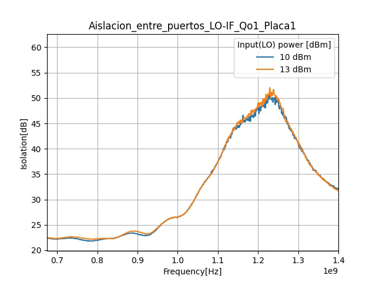
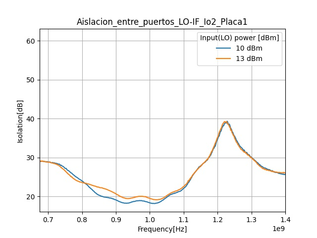
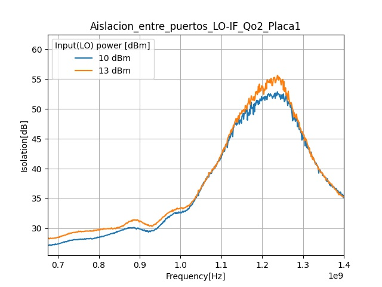
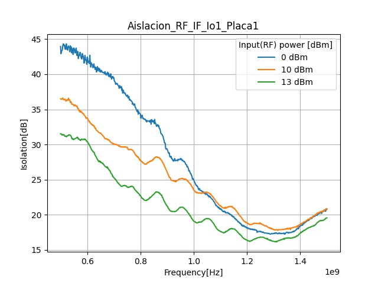
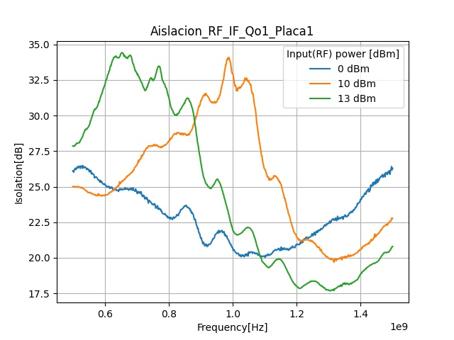
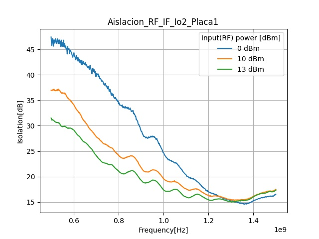

# Puntos de interes
> ### Describir conexionado, señales que estan y no estan

> ### Aislacion, en señales parasitas RF,LO (con y sin RF)

> ### Perdidas, en señales de interes IF

> ### Diferencia en path total vs dif en componentes discretos 

> ### ***Ver armonicas antes de hacer un barrido de frecuencia (las arm pueden tener mayor potencia que la señal en algun punto)***

-----------------------
# Sobre los barridos en frecuencia.
Para aislacion RF/IF se noto que en ciertos puntos las armonicas tenian mas potencia que que la señal de entrada RF, esto hace inviable un barrido de frecuencias para la asilacion. Si bien en algunos puntos la grafica muestra el nivel de RF, en otros muestra el nivel de las armonicas aun cuando RF se anule.

Por eso se descartaron algunos datos y se cambio el proceso de medicion:

* Antes de hacer un barrido, variar "a mano" la señal de entrada y detectar si en algun punto hay armonicas con mayor potencia que la fundamental.

* Si es este el caso, se estudia el comportamiento y se definen frecuencias discretas de interes segun el caso, luego se toman los datos. Sino, se realiza el barrido normal.

-------------------------------------------------------

# Plan de mediciones FIADC
---------------------------------
## Instrumental:
* RIGOL-DSA815: Analizador de espectro.
* HP-8350B: Generador de barrido.
* SG384: Generador de funciones.
* "mod de gen usb"

## Placas:
Definidas como:
* Placa1 (sin salida de spliter en cuadratura).
* Placa2 (LO con salidas en fase y cuadratura).

-------------------------------------------------

# Mediciones en funcionamiento directo.
-------------------------------------------------

## Aislacion LO/IF (Ch1/Ch2)
---------------------------------------
Se analizo la aislacion entre el LO y las salidas IF.

### Set-up:
> Imp 50ohm en RF.

> Pot LO: 10dBm, 13dBm. 

> Barrido frec: 675-1500MHz (no aparecen armonicas para el rango).

### Observaciones:
Solo Io1 no presento armonicas desde LO a 600MHz, para todos los demas se barrio desde 675MHz.

### Graficas:

## Aislacion RF/IF Ch1
-------------------------------------
### Set-Up:
> Imp 50ohm el LO.

> Pot RF: 0dBm,10dBm,13dBm.

> Barrido frec: 500-1500MHz.

### Observaciones:
* Con 0dBm no existen armonicas (27dB att a 1.2GHz) Io1.
* Con 0dBm no existen armonicas (29.5dB att a 1.2GHz) Qo1.

1. Para Io1 a 100 aparecen armonicas impares 300, 500, 700, 900 y arm pares con menor potencia. 

2. Para Qo1 a 100 aparecen armonicas impares 300, 500, 700, 900 y arm pares con potencia considerable (mayores que en Io1). 

3. A 300MHz el barrido empieza a separarse de la respuesta real, por tanto como frecuencia inferior de barrido se tomo 500MHz.

### Graficas:

Notamos que entre 200 - 300 MHz la señar de RF no aparece en la salida pero si sus armonicas, y con mayor amplitud (Io/Qo).

Para valores mayores a 300 se noto que la aislacion baja con la frecuencia.

## Aislacion RF/IF Ch2
------------------------------------
### Set-Up:
> Imp 50ohm el LO.

> Pot RF: 0dBm,10dBm,13dBm.

> Barrido frec: 500-1500MHz.

### Observaciones:
* Con 0dBm no existen armonicas (26dB att a 1.2GHz) Io2.
* Con 0dBm no existen armonicas (27dB att a 1.2GHz) Qo2.

1. Para Io2 a 100 aparecen armonicas impares 300, 500, 700, 900 y arm pares con menor potencia. 

2. Para Qo2 a 100 aparecen armonicas impares 300, 500, 700, 900 y arm pares con potencia considerable (mayores que en Io2). 

3. Para Io2 desde 100 existen armonicas pero en ningun punto del espectro estas tienen mas potencia que la señal de RF, por tanto se podria barrer desde 100MHz.

4. Para Qo2 desde 100 y a 0dBm existen armonicas pero en ningun punto del espectro arriba de 500MHz tienen mas potencia que la señal de RF, por tanto se eligio 500MHz como la frecuencia inferior.

### Graficas:

Para Io2 la pot de las armonicas se mantiene menor o igual, pero en todo punto del espectro hay señal de RF en la salida (no hay pico de aislacion).

En todos los casos la aislacion baja con la frecuencia.

(revisar imagen)

-------------------------------------------------------
-------------------------------------------------------

# Registro de avances
--------------------------------

# ***Registro [270921]:***

> Se comenzo midiendo el generador de barrido HP 83525A, y se noto que existen 2 armonicas ademas de la fundamental para distintas frecuencias, por tanto se filtrara este generador de ahora en adelante.

* Se utilizaron 2 filtros de 1GHz para el LO.

* Se puso 600MHz en RF, junto con w filtros de 630MHz en el puerto, y se midio la señal que llega a LO. Se encontro que en LO esta la fundamental y la segunda armonica de RF.

> Si RF es menor a LO al caer la aislacion del spliter en cuadratura, aparecen RF y su segunda armonica (en el mejor de los casos) que se propagan a el puerto LO de los mixers.

* Estas armonicas al estar en uno de los puertos de entrada de los mixers ***generan productos de intermodulacion que se ven en IF*** 

**POR TANTO: SE DEFINE CONDICION PARA RF > 1GHz.**

* Como ultima medida se noto para varias frecuencias como la señal IF vuelve a aparecer con potencia considerable en LO (quizas generando realimentacion), por lo que IF estaria presente en ciertas componentes de LO.

> RF en LO, LO en RF y a la vez IF en LO.

------------------------------------------------------
------------------------------------------------------

# Data auxiliar/falta revisar
caracterizaicion de spliters

splitQ = -4dB
split = -8.5dB

FREC MAX DE TRABAJO
1. IN=2GHz (2*LO)
2. CLK=BW SPLITQ
3. OUT=2GHz (2*LO)

Se ingreso 1GHz en el LO y se obtuvo la tabla de armonicas para las salidas, con diferentes potencias del LO. (impedacia de 50 en RF)

Luego se realizo un barrido en frecuencias para el LO y se obtuvieron las respuestas para las salidas I/Q de ambos canales, para diferentes potencias del LO. 

"entre 1.1/1.2GHz hay mas atenuacion"

Se ingreso 1.2GHz en la entrada de RF y se obtuvo la tabla de armonicas para las salidas con diferentes potencias del LO. 

"imagenes de armonicas"

Luego se realizo un barrido en frecuencias para el LO y se obtuvieron las respuestas para las salidas I/Q de ambos canales. 

-----------------------------------------------

## Aislacion LO/RF (pl1)
* HP 8350B: fc: 1GHz.
* pwr: 5/10/15dBm.

* Medicion: Att LO/RF (pwrLO-pwrRF), canales I,Q, Promediado para 5,10,15dBm.

### Att
1. Para 5dBm:  5-(-43.5)=48.5dB 
2. Para 10dBm: 10-(-40)=50dB
3. Para 15dBm: 15-(-39.2)=54.3dB

Promedio : 50.9 dB

---------------------------------------

## SPLITER-QUAD *(BW: 675-1300MHz)* (pl2)
* HP 8350B: start: 675MHz - stop: 1.3GHz.
* time: 10ms - pwr: 5/10/15dBm.

* Resp: Cos1
* AttMedia: 3.4dB aprox.

* Resp: Sin1
* AttMedia: 3.5aprox.

Datos tomados: csv/graficos python.

-----------------------------------------------

## MIXER-CONVLOSS *(BW: 675-1300MHz)*
* HP 8350B: start: 675MHz - stop: 1.3GHz.
* time: 10ms - pwr: 5/10/15dBm.
* RIGOL DSA815

* Resp: Cos1
* AttMedia: 3.4dB aprox.

* Resp: Sin1
* AttMedia: 3.5aprox.

Datos tomados: csv/graficos python.

----------------------------

## INVERSO(Sin LO) FI/RF (pl1)
* HP 8350B: 100/200/300MHz.
* pwr: 5/10/15dBm.
* RIGOL 

Datos tomados: Imagenes/Tabla de arm.